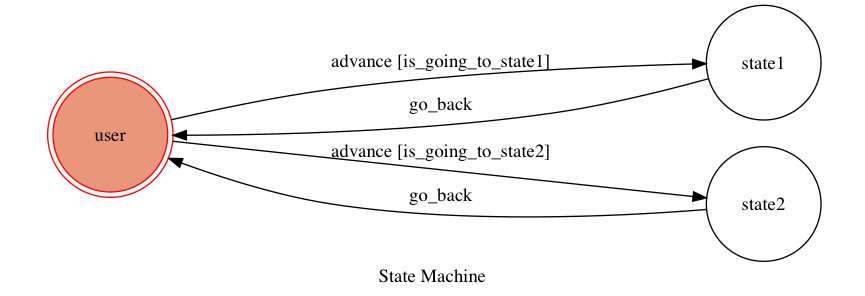

#TOC Project 2021

A line bot used for recording daily expense, watching weather report and watching daily news.

## Finite State Machine

## Usage
The initial state is set to `user`.

Every time `user` state is triggered to `advance` to another state, it will `go_back` to `user` state after the bot replies corresponding message.

* user (start with entering "你好")

	* 記帳: 
		1.輸入項目和金額
			Enter an item and cost to record. 	
		2.總金額消費
			Display the total cost of your items.
		3.清空
			Clear all items and cost recorded.

	* 天氣狀況 (only **Municipality** in Taiwan):
		1.北部:
			(1)臺北:
				Watch climate report in Taipei in Taiwan.
			(2)新北
				Watch climate report in New Taipei in Taiwan.
			(3)桃園
				Watch climate report in Taoyuan in Taiwan.
		2.中部:
			(1)臺中
				Watch climate report in Taichung in Taiwan.
		3.南部:
			(1)臺南
				Watch climate report in Tainan in Taiwan.
			(2)高雄
			 	Watch climate report in Kaosiung in Taiwan.

	* 頭條新聞:
		Watch daily News from ETtoday. (More information:https://www.ettoday.net/)

